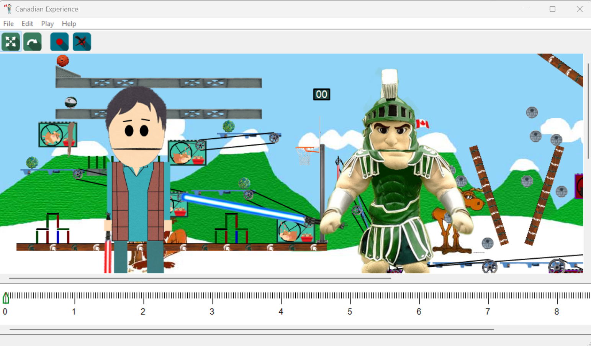

# 2D_Animation_Software-Class_Project
## Overview

The **2D_Animation_Software-Class_Project** is a sophisticated C++ application designed to simulate both machine systems and animated actors using a range of physics-based and graphical components. The project integrates physics simulations (via Box2D) and keyframe-based animation systems to create a dynamic, interactive environment for both machine components (like conveyors and pulleys) and animated actors.

An already compiled executable is located within the Precompiled Executable folder.


---

## Features

- **Physics Simulation**: Utilizes Box2D for simulating physics-based behaviors such as movement, rotation, and collision.
- **Animation Systems**: Implements a keyframe-based animation system for actors and components.
- **Machine Systems**: Allows the creation and simulation of machine systems, including conveyors, pulleys, and rotating sources.
- **Modular Components**: The system is built with highly modular components, including factories for generating machines and animations.
- **Interactive GUI**: Uses wxWidgets for a rich graphical user interface with support for user interaction and visualization.

---

## How It Works

### **What**
The project simulates machines with components like conveyors and pulleys while allowing animated actors to perform within the same system. Keyframe-based animations control the movement of both machine components and actors.

### **How**
- **Box2D Integration**: The physics engine provides real-time simulation of interactions between physical components such as bodies and rotating mechanisms.
- **Keyframe Animation**: Animations for characters and machine components are driven by keyframes, allowing precise control over angles, points, and transformations.
- **Modular Design**: Classes such as factories and adapters are used to generate machine systems, while separate classes handle animation channels and keyframe data.

### **Outcome**
This system creates an interactive simulation of machine components and animated actors, suitable for dynamic system modeling.

---

## Class Structure

### Physics and Collision Management
- **`Cb2ContactListener`, `CContactListener`**: Handles collision detection and response within the physics simulation.
- **`Cb2Draw`, `CDebugDraw`**: Provides debugging tools to visualize physics objects and their interactions.

### Core Components
- **`CComponent`**: A base class for various machine components like bodies, conveyors, and pulleys.
- **`CBody`, `CConveyor`, `CPulley`**: Represent physical entities within the machine systems.
- **`CRotationSource`, `CIRotationSink`**: Facilitate rotation transmission within machine components.

### Game Objects and Animation
- **`CHamster`, `CGoal`**: Simulated objects within the environment, such as a hamster and goal objects.
- **`CActor`, `CAnimChannel`, `CAnimChannelAngle`, `CAnimChannelPoint`**: Keyframe-based animation system for actors and components, with support for animating angles and points.
- **`CKeyframe`, `CAnimChannel::Keyframe`**: Represents a keyframe in the animation system.
- **`CAnimChannelAngle::KeyframeAngle`**: A keyframe specifically for animating angles.
- **`CAnimChannelPoint::KeyframePoint`**: A keyframe for animating point-based movements.

### Machine Systems and Factories
- **`IMachineSystem`, `CMachineSystemActual`, `CMachineSystemStandin`**: Represent machine systems, with stand-in and actual implementations.
- **`CHamsterAndConveyorFactory`, `CMachineFactory1`, `CMachineFactory2`**: Factories for generating different machine systems.
- **`CMachineSystemFactory`**: A factory for creating complex machine systems.
- **`CMachineAdapter`**: Adapter pattern used to interface between different machine components and systems.

### Graphics and Drawing
- **`Ccse335::Polygon`, `Ccse335::PhysicsPolygon`**: Represent polygons and physics-based polygons for drawing in the simulation.
- **`CPolyDrawable`**: Handles the drawing of polygons within the system.

### User Interface and Dialogs
- **`CwxDialog`, `CwxFrame`, `CwxScrolledCanvas`**: Used for creating and managing the user interface and providing a scrollable canvas for drawing.
- **`CMachineStartTimeDlg`, `CTimelineDlg`**: Specialized dialogs for setting machine start times and managing timelines in the simulation.
- **`CViewEdit`, `CViewTimeline`**: Manage the visual editing and timeline views for animations.

### Image and Actor Management
- **`CPicture`, `CPictureFactory`, `CImageDrawable`**: Handle images and actors within the system.
- **`CSpartyFactory`**: A specific factory for creating Sparty-themed actors for demonstration.

---

## Prerequisites

To run the program, you will need:

1. **C++ Compiler**: A compiler like `g++` or `clang` that supports C++17 or later.
2. **Box2D Library**: The physics engine used for collision detection and simulation.
3. **wxWidgets Library**: For GUI rendering and user interface management.

---

## Installation and Usage

### Clone the Repository
Clone the repository to your local machine:
```bash
git clone https://github.com/your-username/Animation-Machine-Simulation.git
cd Animation-Machine-Simulation
